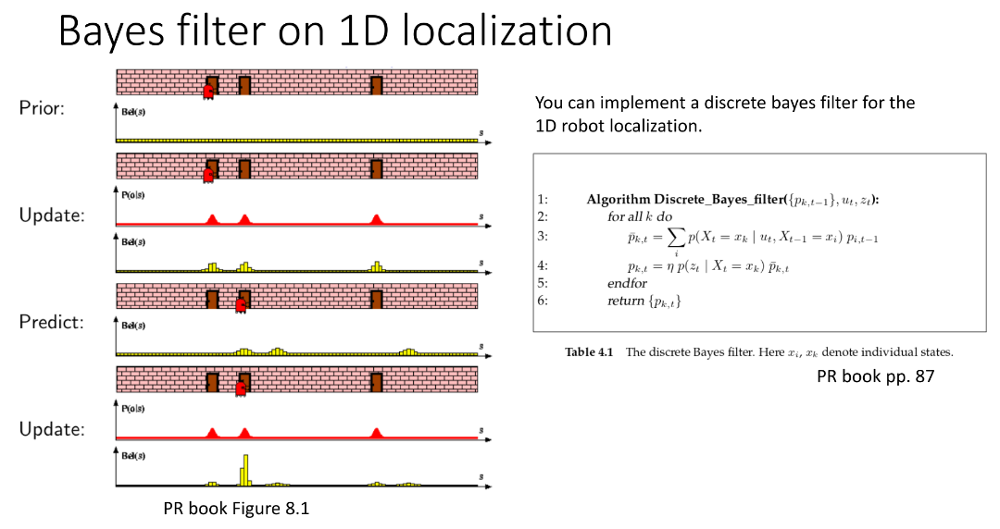
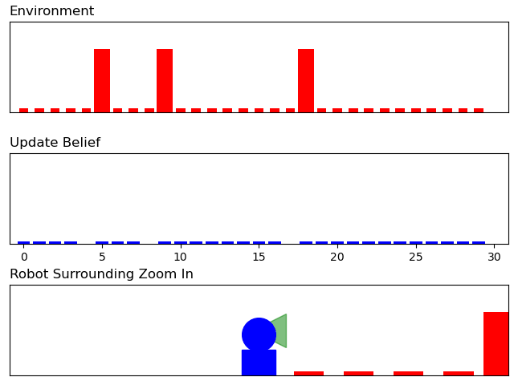

# BayesFilter-Localization

Let us use the discrete Bayes filter algorithm to solve an one-dimensional localization problem.
The problem solving procedure and the algorithm are described as below.

In our simulation, we assume the door detection as a binary detection, and the door is detected only when the robot is one-unit distance to the door.
The robot movement uncertainty is considered. The control command is to move one unit, and when executing this command, the following three possibilities could happen:
- move one unit with the probability of 80%
- move two unit with the probability of 10%
- not move with the probability of 10%

By running "bayes_localization.py", you can get the following animation. 

